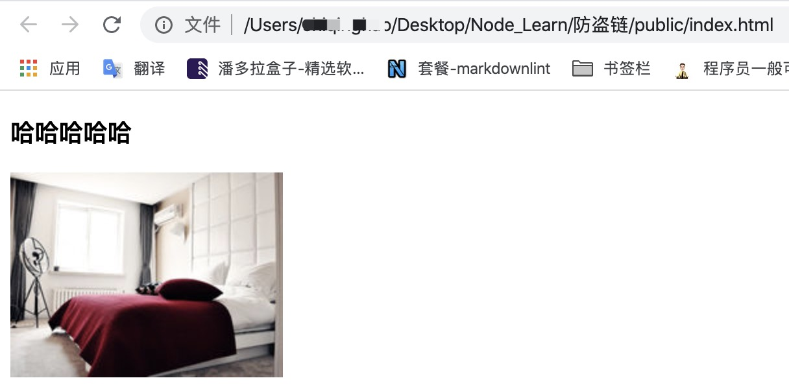

防盗链

#### 什么是防盗链

  盗链，顾名思义就是盗窃链接，就是在他人未经允许的情况下，去使用他人站点的任何图片，视频，内容等资源，来借此提升已用的站点的活跃度，严重损坏了别人的利益。那么防盗链就是采用一些办法阻止自己的资源被盗用。

#### 模拟图片防盗链

  一般情况下图片防盗链居多，我们来看看图片防盗链是如何做出来的。

    <body>
      <h3>哈哈哈哈哈</h3>
      
    </body>

  分两种形式展示

  * 本地file直接打开index.html
  
  * 本地起一个服务，模拟站点，打开index.html
  

  由此可见，没有起服务时显示的是正常的图片，起了服务后就变了另一张图片，这就是百度对图片做了防盗链处理。
  从这个可以得出一个结论，所谓的防盗链处理是针对与服务器上而言的，file起的页面是无效的

#### 实现防盗链

  据查阅资料可知，防盗链是通过Host和Referer进行比较来实现的，下面用node实现一个防盗链

  * 1 准备两种图片，一个正常下载的图片的，一个为了防盗而显示的图片。

  * 2 准备一个域名，为了模拟服务器。
    host文件 更改
    
        127.0.0.1 www.sqh17.com

  * 2 实现

    * 思路：
      1. 创建http的server
      2. 首先读取文件，判断文件是否存在
      3. 判断referer和host是否一致，不一致则进行图片
      4. 启动服务

    * 代码
        index.html文件

          <body>
            <h3>哈哈哈哈哈</h3>
            
          </body>

        js文件

          let fs = require('fs');
          let path = require('path');
          let http = require('http');
          let url = require('url');
          let static = path.resolve(__dirname, "public"); // 静态资源目录
          let server = http.createServer((req, res) => {
            let referer = req.headers['referer'] || req.headers['referered']; // 兼容性处理

            let pos = path.join(static, url.parse(req.url).pathname); // 处理成绝对路径
            fs.stat(pos, err => { // 先判断文件存不存在
              if (!err) {
                if (referer) { // 当存在referer
                  let refererHost = url.parse(referer).hostname; // referer地址
                  let host = req.headers['host'].split(':')[0]; // host地址

                  if (refererHost !== host) {
                    // 若不一致，则替换图片
                    fs.createReadStream(path.join(static, '/fail.png')).pipe(res);
                  } else {
                    fs.createReadStream(pos).pipe(res);
                  }
                } else {
                  // 第一次index.html的显示
                  fs.createReadStream(pos).pipe(res);
                }
              } else {
                res.end("Not Found");
              }
            });

          })
          server.listen('8888', () => {
            console.log('服务器开启成功', '端口:8888');
          })

      * 演示

        当地址栏上的地址是http://www.sqh17.com:8888/index.html时，显示的是正常的图片

        
        

        当地址栏上的地址是http://localhost.com:8888/index.html时，显示的是防盗链的图片

        
        

#### 总结
 
  防盗链的方式有很多，利用referer和host的比较来实现防盗链是其中的一种，上述方式虽然很简单，但是是提供了一种思路，方便为自己以后的网站搭建，在项目开发中可能会更加复杂化。
   

